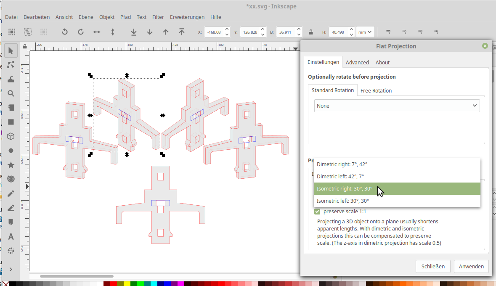
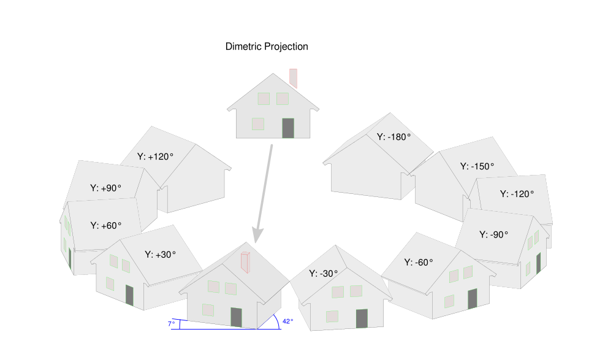

# inkscape-flat-projection

This inkscape extension installs a new menu entry under "Extensions" -> "Modify Path" -> "Flat Projection..."

Apply a 3D rotation matrix to 2D objects, then apply an axiometric projection back into the 2D plane.
This implements parallel projection. The side walls use algorithm T as described by Donald Knuth.

(For perspective projection see Tav's perspective extension.)

 
  
 

To compose arbitrary scenes, objects can be rotated before perspective is applied:

